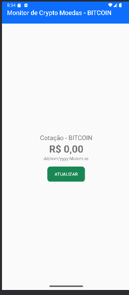
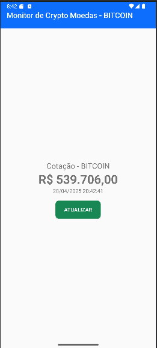

# CP02 - CryptoMonitor

Este projeto é um aplicativo Android desenvolvido em Kotlin, que permite consultar informações de criptomoedas em tempo real usando a API do Mercado Bitcoin.

## Evidências

## Estrutura dos Arquivos Kotlin

### 1. **Service** (`MercadoBitcoinService.kt`)

Define a interface de comunicação com a API de criptomoedas usando Retrofit.

- Anotado com `@GET("api/BTC/ticker/")`, ele realiza uma chamada HTTP GET para buscar informações atualizadas do Bitcoin.
- A função `getTicker()` é **suspend** para ser chamada dentro de corrotinas (`CoroutineScope`), retornando uma resposta `Response<TickerResponse>`.

---

### 2. **Factory** (`MercadoBitcoinServiceFactory.kt`)

Responsável pela criação da instância de Retrofit configurada.

- Define a base URL: `https://www.mercadobitcoin.net/`.
- Adiciona o conversor Gson para transformar o JSON da API em objetos Kotlin.
- Cria e retorna uma implementação concreta de `MercadoBitcoinService`.

---

### 3. **Main** (`MainActivity.kt`)

Gerencia a interface principal do app e a lógica de atualização de dados.

- Configura a **Toolbar** e o botão de **Atualizar**.
- Quando o botão é clicado, dispara uma chamada REST assíncrona para obter o preço atual do Bitcoin.
- Atualiza o valor
---
### 4. **Model** (`TickerResponse.kt`)

Define as classes de dados que representam a resposta da API.

- `TickerResponse` contém um objeto `Ticker`.
- `Ticker` contém os seguintes campos:
    - `high` (valor máximo)
    - `low` (valor mínimo)
    - `vol` (volume negociado)
    - `last` (último preço)
    - `buy` (preço de compra)
    - `sell` (preço de venda)
    - `date` (timestamp da cotação)

Essas classes são usadas automaticamente pelo Retrofit para desserializar a resposta JSON recebida da API.

---

